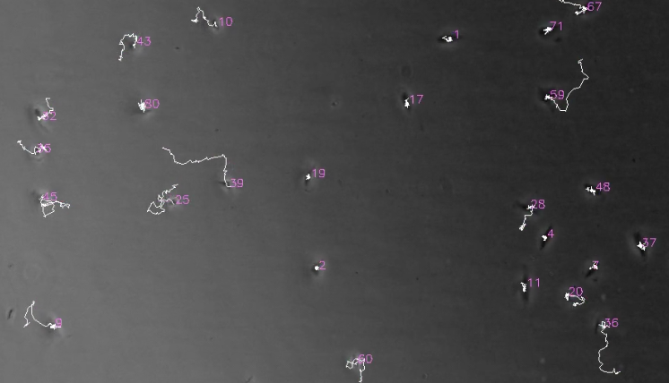

[](https://acit.readthedocs.io/en/latest/?badge=latest)
[](https://travis-ci.org/nimne/acit)

# ACIT (Automated Cell Identification and Tracking) readme

This program was designed to track motile epithelial cells imaged with phase contrast microscopy.
More complete documentation can be found here.

This program will take difficult phase contrast images and track cells like this:



Typically, cells are fairly low contrast when iamged and will change in appearance during the normal process of cell motility. Tracking these cells becomes difficult when they are infected with bacteria, which also show up in the phase contrast images.

This project uses the deep learning algorithm `resnet50` implemented in the `keras-retinanet` project to do object identification and localization.

The machine learning model was trained on approximately 300 manually annotated images over 75 epochs, each with 3000 steps.

A few assumptions are made during the processing of the output data.
These include:

- Identified centers > 20px from each other are considered separate cells.
  - This is hardcoded in track_tools/box_filters
- Spots that are within 20 px are chosen based on 1: highest score, then 2: box size (with bigger boxes winning).

## Installation
In addition to this program, FiJi and ffmpeg are necessary for full functionality. Note that this
only works with Python 3.6 and 3.7 due to tensorflow version requirements. This should
work on Linux, Windows, and MacOS, but is only tested on Linux and MacOS.

### Installing FiJi
Cell tracking requires a functioning installation of [FiJi](https://imagej.net/Fiji) in your path.
You will also need to install the [Track analysis](https://imagej.net/TrackMate#Extensions) plugin for TrackMate.

ACIT will attempt to use the correct ImageJ binary for your system, however
the ImageJ path to the ImageJ binary must be added to the $PATH.
Alternatively, set the environment veriable `IJ_BIN_PATH` equal to folder with the ImageJ binary.
For example, on MacOS 10.13, open the terminal and run:
```
export IJ_BIN_PATH=/Applications/FiJi.app/Contents/MacOS
```
### Installing ffmpeg
`ffmpeg` is used to produce videos of the tracked cells during the output. This is not
strictly required, however it is recommended for easy debugging.

Installation on mac and linux is straight forward using a package manager. [Homebrew](https://brew.sh/) on mac works well
```
brew install ffmpeg
````
or use the native package manager on a linux system, for example:
```
apt install ffmpeg
```
For installation from source or on windows please see the [ffmpeg site](https://www.ffmpeg.org/download.html).
### Installing ACIT
There are two options:
1. Clone the github repo and install
```
python -m pip install -e .
```
2. Alternatively, clone the github repo, install the dependencies and run in place.
```
git clone https://github.com/nimne/acit
pip install -r requirements.txt
```

## Running

API documentation is available in the autodocs, however this is mostly
intended that this be run as a module
```
python -m cell_track
```
Running the module with no command line options opens a GUI.
Note that processing with a GPU is not available from the GUI.

A full list of options is available by running:
```
python -m cell_track -h
```
## Training on your own images
#### Image annotation
The most important part of any computer vision based project is a good training set,
the more images the better. One of the more helpful things is that a large dataset
of images lacking cells really helps the training, and this data is easy to create.

The process for creating a training set is fairly straight forward, and a few
helper scripts are included to make this process simpler. First, start off
by cloning the git repo. Then navigate to the `./cell_track/utilites/training` folder.
```
cd ./cell_track/utilities/training
```

Collect a set of TIF formatted images in the 'cells' and 'no_cells' folders in the
'training' directory.

For each image in the 'cells' directory, annotate the cell positions using
[ALPs labeling tool](https://alpslabel.wordpress.com/2017/01/26/alt/).

To convert the annotations into a format that can be used to train a
model, a conversions script is included. If necessary, convert the anotations
from micro meters to pixel positions. This can either be done in ImageJ,
or after annotation by editing the `um_to_px` function in `convert_alp_annotations.py`.

Then, run the script.
```
python ./convert_alp_annotations.py
```

Now, we're ready to train the model. This part take a LONG time to run.
You should run this on a CUDA compatible GPU with at least 4gb of memory. Plan
on running this for at least four days with the training settings used for the
model in the github repo. Model snapshots will be saved to `./snapshots`

```
python keras_train.py csv ./imagej_alp_train.csv ./category.csv
```
The default values in the training script have been tweaked to reflect
the settings used to trian the model here, however many parameters can be changed.

See the built-in help for more information.
```
python keras_train.py --help
```
## Changelog

0.1.0 - Intial release


## Original files

Please contact me if you are interesting in the training 
data set, or have questions about using this module.
